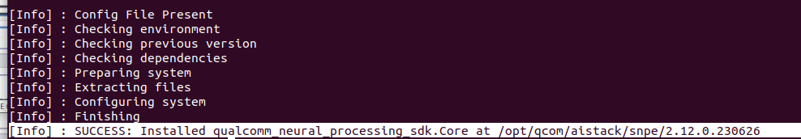

# SNPEv2_Tutorial

SNPE v2 simple tutorial

## Contents

- [Explanation of the execution sequence](#1)
- [Docker Installation](#2)
- [SNPE installation](#3)
- [Hexagon SDK installation](#4)
- [DLC Conversion via SNPE Commands](#5)
- [Camera Settings](#6)
- [Inference](#7)

## Explanation of the execution sequence <a name="1"></a>


## Docker Installation <a name="2"></a>

- OS: Ubuntu 22.04
- GPU: RTX 4070

### Install docker

```bash
sudo apt-get update						
sudo apt-get install \ ca-certificates \ curl \ gnupg			 
sudo mkdir -m 0755 -p /etc/apt/keyrings				
curl -fsSL https://download.docker.com/linux/ubuntu/gpg | sudo gpg --dearmor -o /etc/apt/keyrings/docker.gpg

echo \ "deb [arch="$(dpkg --print-architecture)" signed-by=/etc/apt/keyrings/docker.gpg] https://download.docker.com/linux/ubuntu \ "$(. /etc/os-release && echo "$VERSION_CODENAME")" stable" | \ sudo tee /etc/apt/sources.list.d/docker.list > /dev/null			

sudo apt-get update					
sudo apt-get install docker-ce docker-ce-cli containerd.io docker-buildx-plugin docker-compose-plugin
```

- Note: [Linux post-installation](https://docs.docker.com/engine/install/linux-postinstall/)

### ssl1.1 install (for Ubuntu 21 and newer)

```bash
echo "deb http://security.ubuntu.com/ubuntu focal-security main" | sudo tee /etc/apt/sources.list.d/focal-security.list
sudo apt-get update
sudo apt-get install libssl1.1
```

### Nvidia-docker installation

```bash
distribution=$(. /etc/os-release;echo $ID$VERSION_ID) \ && curl -s -L https://nvidia.github.io/nvidia-docker/gpgkey | sudo apt-key add - \ && curl -s -L https://nvidia.github.io/nvidia-docker/$distribution/nvidia-docker.list | sudo tee /etc/apt/sources.list.d/nvidia-docker.list		

sudo apt-get update						
sudo apt-get install –y nvidia-docker2				

sudo systemctl restart docker	

sudo apt-get update && sudo apt-get install -y nvidia-container-toolkit	

sudo systemctl restart docker					

```

### Image verification to configure Docker environment (using NGC link)

- NGC(Nvidia GPU Cloud): 

    - [Tensorflow](https://docs.nvidia.com/deeplearning/frameworks/tensorflow-release-notes/rel-22-12.html#rel-22-12)
    - [Pytorch](https://docs.nvidia.com/deeplearning/frameworks/pytorch-release-notes/rel_21-08.html#rel_21-08)

### Docker run

```bash
docker run -it --gpus all -v <host_path>:/workspace <docker image> /bin/bash

docker run -it --gpus all -v /home/gb/snpe_212:/workspace nvcr.io/nvidia/tensorflow:22.12-tf2-py3 /bin/bash # Example

```

- Output:


- Shared a folder inside Docker with the specified Host path


    - Host path: home/gb/snpe_212
    - Docker path: /workspace


- Note: 
    - [Docker cheatsheet](https://dockerlabs.collabnix.com/docker/cheatsheet/)
    - [Image Tags](https://catalog.ngc.nvidia.com/orgs/nvidia/containers/pytorch/tags)

## SNPE installation <a name="3"></a>

### Qualcomm Package Manager installation

- [Follow this link](https://qpm.qualcomm.com/#/main/tools/details/QPM3
) (Login requiered)


### Qualcomm Neural Processing SDK (v2.12)

- Tools => Qualcomm AI Stack => Neural Processing SDK


- Extract:

```bash
qpm-cli --login <username>
qpm-cli --license-activate qualcomm_neural_processing_sdk
qpm-cli --extract qualcomm_neural_processing_sdk # (or) qpm-cli --extract <full path to downloaded .qik file>
```
- Note: If you meet error like below, refer [this](https://developer.qualcomm.com/forum/qdn-forums/software/hexagon-dsp-sdk/toolsinstallation/70818):

```bash
[Error] : Failed ProductKit License Agreement : Response from Createpoint: {"active":0,"agreementRevId":67}
```

- Installation path



## Hexagon SDK installation <a name="4"></a>

- Qualcomm Package Manager -> Tools -> Qualcomm Hexagon SDK Products -> Hexagon SDK 4.X installation


## DLC Conversion via SNPE Commands <a name="5"></a>

### Run docker

```bash
docker run -it --gpus all -v /opt/qcom/aistack/snpe/2.12.0.230626:/workspace nvcr.io/nvidia/pytorch:21.08-py3 /bin/bash
```

### Fix something

```bash
apt install libc++-dev
pip install onnx==1.8.0
pip install numpy==1.20
pip install onnx-simplifier

```

### snpe-onnx-to-dlc usage

```bash
snpe-onnx-to-dlc --input_network ./yolov7_2stream.onnx --out_node /model.159/Transpose_output_0 --out_node /model.160/Transpose_output_0 --out_node  /model.160/Transpose_output_0  --output_path ./asdf.dlc
```

- Note: Get out_node name by [netron](https://netron.app/)
- Refer for docs: file:///opt/qcom/aistack/snpe/2.12.0.230626/docs/SNPE/html/index.html

### snpe-dlc-quantize usage

```bash
snpe-dlc-quantize --input_dlc [DLC file to be quantized] --input_list [txt file with example image path to be used for quantization] --output_dlc [Path to save DLC file]

```

## Camera Settings (QCS610) <a name="6"></a>

### Installing the required packages

```bash
sudo apt-get update
sudo apt-get install iputils-ping
sudo apt-get install net-tools
```

### SNPE 

#### IP setting

- Set IPv4 Address to 192.168.7.100 (Depend on your device)
- Set Netmask to 255.255.255.0

#### Ping

- After connecting the camera Ping Check communication via [Camera IP] command
- After Confirmation adb connect Connecting a camera with the [Camera IP] command

#### Create a route

```bash
adb shell							
mkdir /data/local/tmp/snpeexample/bin && mkdir /data/local/tmp/snpeexample/lib && mkdir -p /data/local/tmp/snpeexample/dsp/lib				
exit
```

#### SNPE File Insertion Example Code

```bash
cd /workspace/snpe_sdk212/lib/aarch64-oe-linux-gcc8.2/ && adb push ./* /data/local/tmp/snpeexample/lib
cd /workspace/snpe_sdk212/bin/aarch64-ubuntu-gcc7.5/ && adb push ./* /data/local/tmp/snpeexample/bin
cd /workspace/snpe_sdk212/lib/hexagon-v66/unsigned && adb push ./* /data/local/tmp/snpeexample/dsp/lib

```

- Note: lib file is oe-linux-gcc8.2, bin file is ubuntu-gcc7.5 use

### Hexagon SDK

```bash
source setup_sdk_env.source
./signer.py sign -s [camera ip]
```

## Inference <a name="7"></a>

### Setting Camera Environment Variables

```bash
adb shell
export LD_LIBRARY_PATH=$LD_LIBRARY_PATH /data/local/tmp/snpeexample/lib && export PATH=$PATH: /data/local/tmp/snpeexample/bin && export ADSP_LIBRARY_PATH=" /data/local/tmp/snpeexample/dsp;/vendor/lib/rfsa/dsp/testsig;/dsp" && snpe-net-run –h

/vendor/lib/rfsa/dsp/testsig # The route is Hexagon SDKPath of the signature file
```

### DSP Verify execution

```bash
snpe-platform-validator --runtime dsp			
```

### DSP Inference

```bash
snpe-net-run --container Origin_qat.dlc --input_list target_raw_list.txt --debug --use_dsp --platform_options unsignedPD:OFF
```


